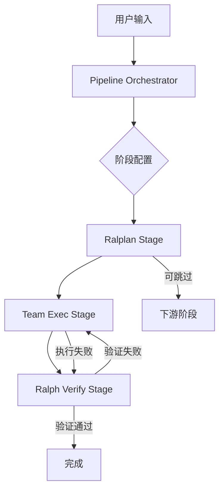
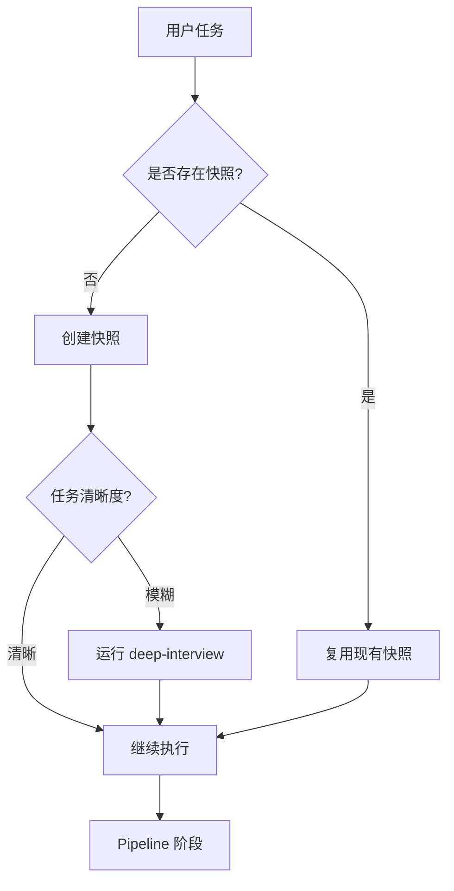
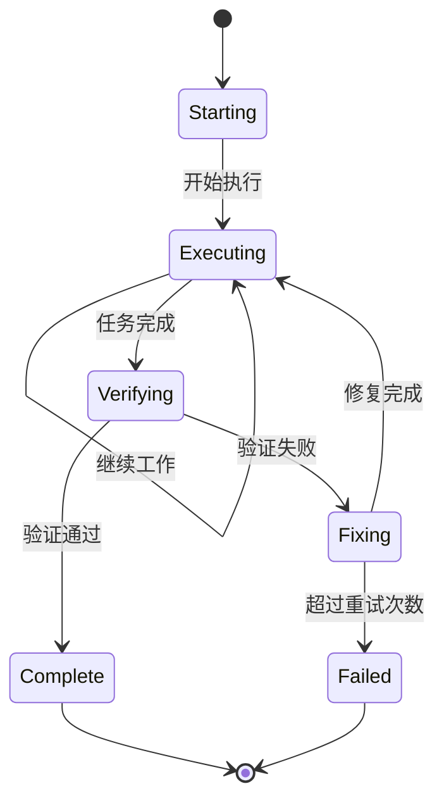

# 项目整合方案：Clawd Code + oh-my-codex

**生成日期：** 2026-01-20  
**整合目标：** 将 oh-my-codex 的优秀特性整合到 Clawd Code 项目中，实现功能增强和架构优化

---

## 一、项目概况对比

| 维度 | 项目 A (Clawd Code) | 项目 B (oh-my-codex) |
|------|---------------------|----------------------|
| **技术栈** | Python 3.10+ | TypeScript/Node.js |
| **核心定位** | AI 编程代理框架 | Codex CLI 工作流层 |
| **多代理架构** | Swarm 集群 | Team tmux 编排 |
| **工作流** | 5阶段引擎 | Pipeline 阶段式 |
| **持久化** | GoalX 认知表面 | ModeState 状态系统 |
| **执行模式** | 单进程内循环 | tmux 多会话 |

---

## 二、相似模块对比分析

### 2.1 工作流引擎

**Clawd Code (`src/workflow/engine.py`)**
- 5 阶段：IDENTIFY → PLAN → EXECUTE → REVIEW → DISCOVER
- 自愈执行器 (HealableExecutor)
- DAG 任务依赖管理

**oh-my-codex (`src/pipeline/orchestrator.ts`)**
- 可配置阶段式管道：RALPLAN → team-exec → ralph-verify
- 状态持久化 + 恢复支持
- 灵活 stage 接口设计

**优势分析：** OMX 的 Pipeline 设计更灵活，阶段可配置、可跳过、可组合

### 2.2 任务循环

**Clawd Code** - Intent Routing
- DELIVER, EXPLORE, EVOLVE, DEBATE 模式

**oh-my-codex** - Ralph 持久循环
- starting → executing → verifying → fixing → complete
- 强制验证门禁
- Deslop Pass 代码脱水

**优势分析：** Ralph 的强制性验证 + 代码质量门禁更完善

### 2.3 团队协作

**Clawd Code** - Swarm Agent
- Orchestrator → Worker/Auditor/Integrator

**oh-my-codex** - Team Runtime
- tmux 多会话编排
- Mailbox/Dispatch 协调
- Worktree 隔离

**优势分析：** OMX 的 Team 运行时更成熟，支持真实多会话协作

### 2.4 技能系统

| 特性 | Clawd Code | oh-my-codex |
|------|------------|--------------|
| 技能定义 | `skills/` 目录 | `skills/` 目录 |
| 触发方式 | 模式匹配 | `$skill-name` |
| 状态管理 | 基础 | ModeState 持久化 |
| 技能组织 | 扁平 | 按功能分类 |

---

## 三、整合建议清单

### 🔴 高优先级（可直接迁移）

#### 1. Pipeline 阶段式架构
**源文件：** `oh-my-codex-main/src/pipeline/`  
**目标：** 整合到 `src/workflow/`

- [ ] 创建 `src/workflow/pipeline.py` - Python 版本的 Pipeline 编排器
- [ ] 设计 `PipelineStage` 接口 - 可配置阶段
- [ ] 内置阶段实现：
  - [ ] `RalplanStage` - 共识规划
  - [ ] `TeamExecStage` - 团队执行
  - [ ] `RalphVerifyStage` - 验证循环

#### 2. Pre-context Intake Gate
**源文件：** oh-my-codex 技能中的"Pre-context intake"设计  
**目标：** 新增 `src/workflow/intake.py`

- [ ] 任务_slug 生成器
- [ ] 上下文快照生成器 (`.clawd/context/{slug}-{timestamp}.md`)
- [ ] 快照字段验证器
- [ ] 快速深访集成 (`deep-interview`)

#### 3. AI Slop Cleaner 集成
**源文件：** `oh-my-codex-main/skills/ai-slop-cleaner/`  
**目标：** 新增 `src/tools/slops_cleaner.py`

- [ ] 代码冗余检测器
- [ ] 自明性注释移除器
- [ ] 语义压缩器
- [ ] CLI 封装

### 🟡 中优先级（需要适配）

#### 4. 状态管理系统增强
**源文件：** `oh-my-codex-main/src/state/`  
**目标：** 增强 `src/core/state.py`

- [ ] ModeState 持久化接口
- [ ] 状态文件读写器 (JSON 格式)
- [ ] 状态迁移器 (版本兼容)
- [ ] HUD 渲染支持

#### 5. Visual Verdict 视觉验证
**源文件：** `oh-my-codex-main/src/visual/` + `visual-verdict` 技能  
**目标：** 新增 `src/tools/visual_verdict.py`

- [ ] 截图对比引擎
- [ ] 差异检测器
- [ ] 评分器 (score >= 90 通过)
- [ ] JSON 输出格式化

#### 6. Team Runtime 协调机制
**源文件：** `oh-my-codex-main/src/team/`  
**目标：** 增强 `src/agent/swarm/`

- [ ] Mailbox 消息队列
- [ ] Dispatch 调度器
- [ ] Worktree 协调器
- [ ] 生命周期管理器

### 🟢 低优先级（参考学习）

#### 7. 技能系统重构
**参考：** oh-my-codex 的技能组织方式  
**目标：** 优化 `skills/` 目录结构

- [ ] 技能分类目录
- [ ] 技能元数据定义
- [ ] 动态技能加载

#### 8. AGENTS.md 模板增强
**源文件：** `oh-my-codex-main/templates/AGENTS.md`  
**目标：** 更新项目根目录 `AGENTS.md`

- [ ] 引入 agent-tiers 定义
- [ ] 添加角色提示模板
- [ ] 最佳实践章节

---

## 四、详细整合方案

### 4.1 Pipeline 架构设计



**核心接口：**
```python
from abc import ABC, abstractmethod
from dataclasses import dataclass
from typing import Any

@dataclass
class StageContext:
    task: str
    artifacts: dict[str, Any]
    previous_stage_result: "StageResult | None"
    cwd: Path
    session_id: str | None

@dataclass 
class StageResult:
    status: "Literal['success', 'skipped', 'failed']"
    artifacts: dict[str, Any]
    duration_ms: int

class PipelineStage(ABC):
    @property
    @abstractmethod
    def name(self) -> str:
        pass
    
    @abstractmethod
    async def run(self, ctx: StageContext) -> StageResult:
        pass
    
    def can_skip(self, ctx: StageContext) -> bool:
        return False
```

### 4.2 Pre-context Intake 流程



### 4.3 Ralph 验证循环



### 4.4 状态文件结构

```
.clawd/
├── context/
│   └── {task-slug}-{timestamp}.md
├── state/
│   ├── pipeline-state.json
│   ├── ralph-state.json
│   └── team/
│       └── {team-name}/
│           ├── config.json
│           ├── manifest.v2.json
│           └── tasks/
└── logs/
    └── workflow.jsonl
```

---

## 五、文件映射表

| 源文件 (oh-my-codex) | 目标文件 (Clawd Code) | 状态 |
|----------------------|----------------------|------|
| `src/pipeline/orchestrator.ts` | `src/workflow/pipeline.py` | 待创建 |
| `src/pipeline/types.ts` | `src/workflow/types.py` | 待创建 |
| `src/ralph/contract.ts` | `src/workflow/ralph_contract.py` | 待创建 |
| `src/team/orchestrator.ts` | `src/agent/swarm/team_orchestrator.py` | 待增强 |
| `src/state/mode-state-context.ts` | `src/core/mode_state.py` | 待创建 |
| `src/visual/verdict.ts` | `src/tools/visual_verdict.py` | 待创建 |
| `skills/ai-slop-cleaner/` | `src/tools/slops_cleaner.py` | 待创建 |
| `templates/AGENTS.md` | `AGENTS.md` | 待更新 |

---

## 六、实施顺序

1. **第一阶段：基础设施**
   - 创建 Pipeline 核心架构
   - 实现 Stage 接口
   - 集成 Pre-context Intake

2. **第二阶段：验证增强**
   - 集成 AI Slop Cleaner
   - 实现 Visual Verdict
   - 增强 Ralph 循环

3. **第三阶段：协调能力**
   - 增强 Team 运行时
   - 完善状态管理
   - HUD 支持

4. **第四阶段：优化**
   - 技能系统重构
   - AGENTS.md 更新
   - 文档完善

---

## 七、风险与注意事项

1. **Python/TypeScript 桥接**：OMX 部分逻辑依赖 Node.js 运行时，需要用 Python 重写
2. **tmux 依赖**：Team Runtime 依赖 tmux，Windows 环境需要 psmux 替代
3. **向后兼容**：整合过程不能破坏现有 Clawd Code 功能
4. **测试覆盖**：新增代码需要对应测试用例

---

## 八、预期收益

- **灵活性提升**：Pipeline 可配置阶段支持更多场景
- **质量保证**：Ralph 循环 + Deslop Pass 提升代码质量
- **协作能力**：Team Runtime 支持真实多会话协作
- **可视化**：Visual Verdict 支持截图对比验证
- **状态持久**：ModeState 支持跨会话恢复

---

*此方案将持续更新，根据实际整合进展调整优先级和实施细节。*
